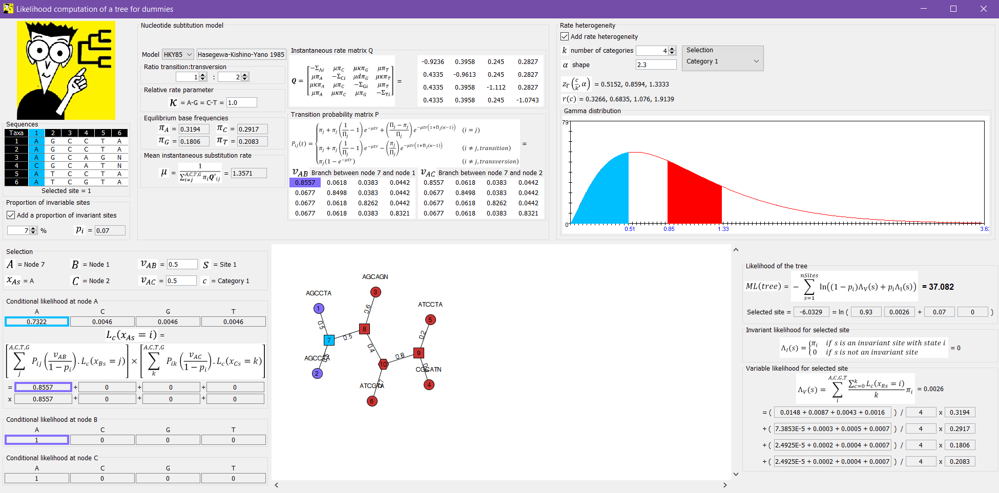

# Likelihood computation of a phylogenetic tree for dummies
This software details visually how a maximum likelihood computation of a phylogenetic tree is computed, using different classic models.

Please refer to the pdf in documentation for detailled explanations.

